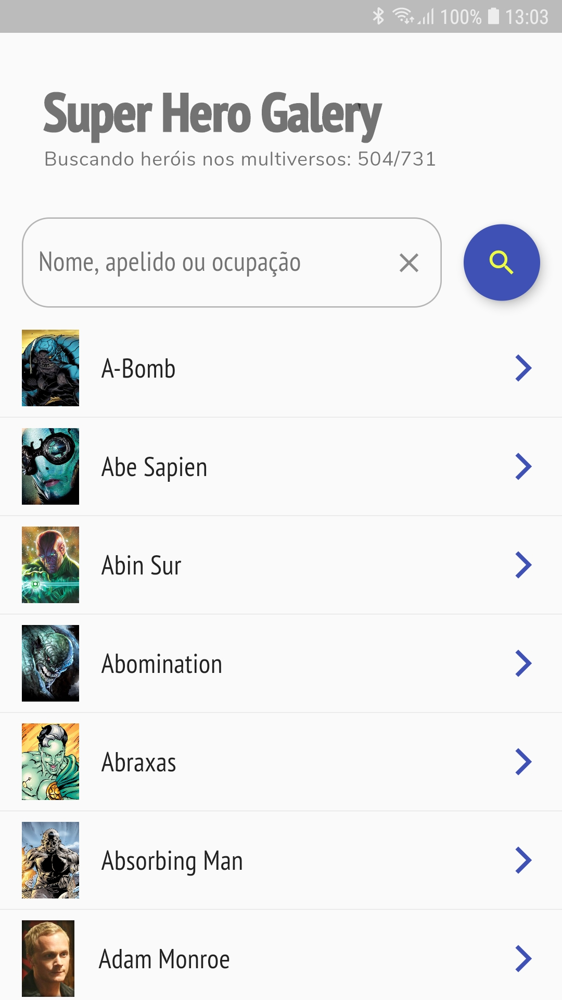
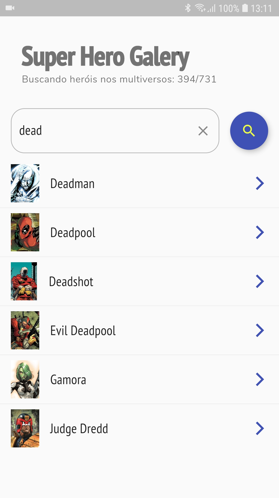
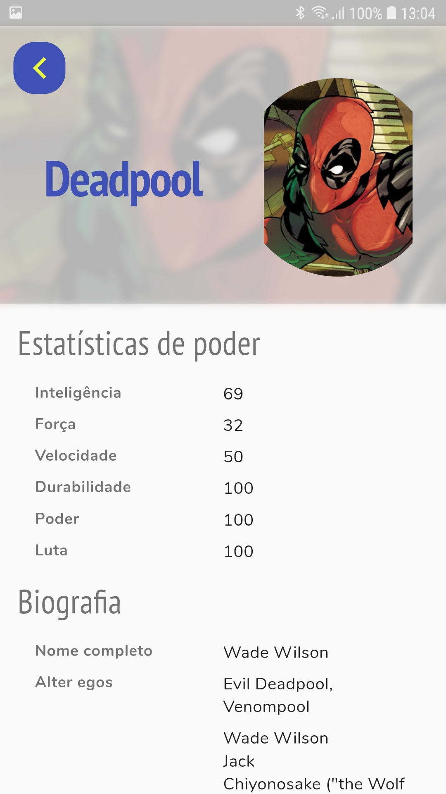
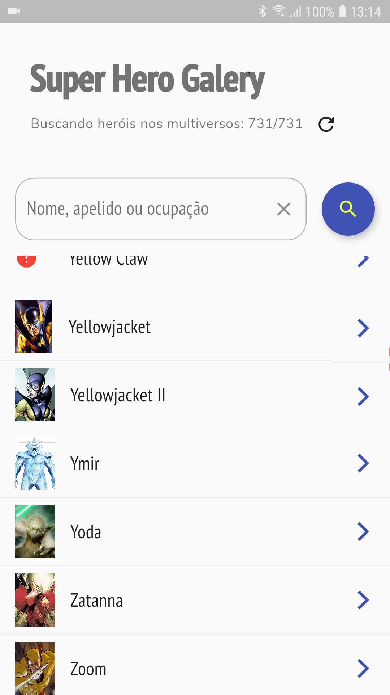

# Super Hero Galery

A gallery to show everything about all the super heroes.

You can use the search box to filter the list to find your favorite super hero.

The search criteria are: Name, alias or occupation.

*Dependencies: MobX, Provider, Dio (http client) and cached network image.*

*Unit tests using **mockito**.*

*SuperHero image animation using Hero widget.*

*Supports **i18n** with English and Portuguese (default).*

## Architecture components

* View (pages);
* Controller (Store from MobX);
* Repository (interface and implementation);
* Models;

## ScreenShots

   

## TODOs

* Improve the UI design.
* Write more unit tests.